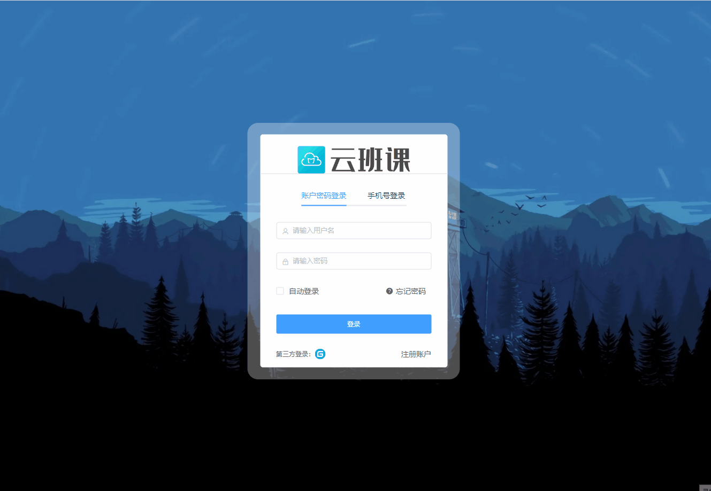
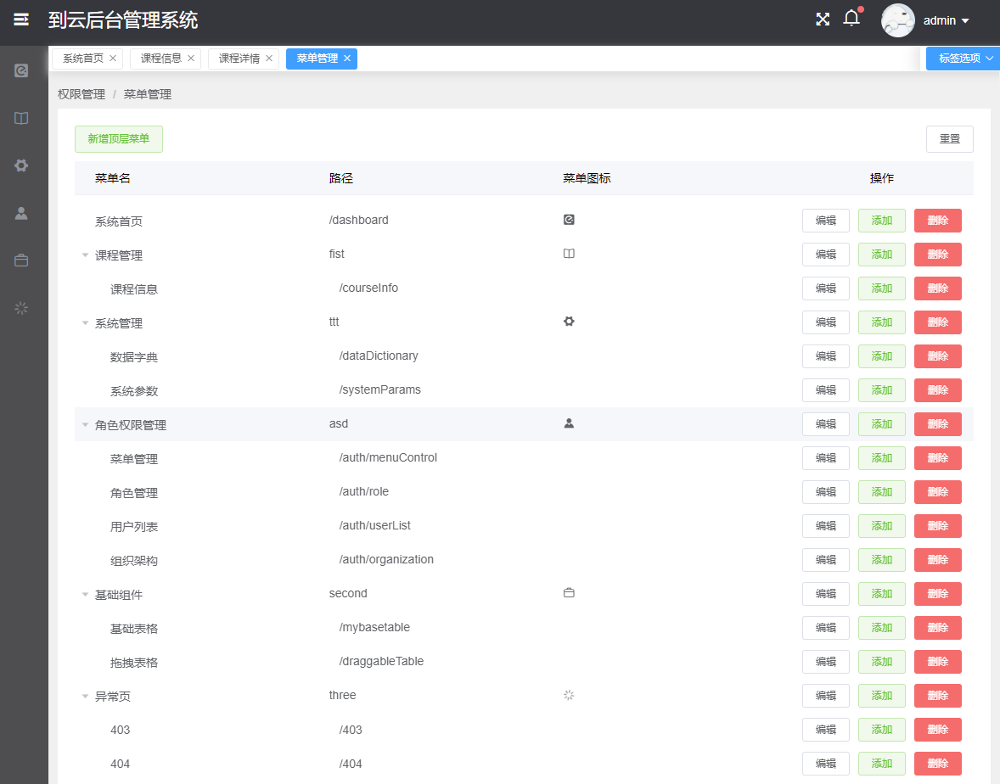
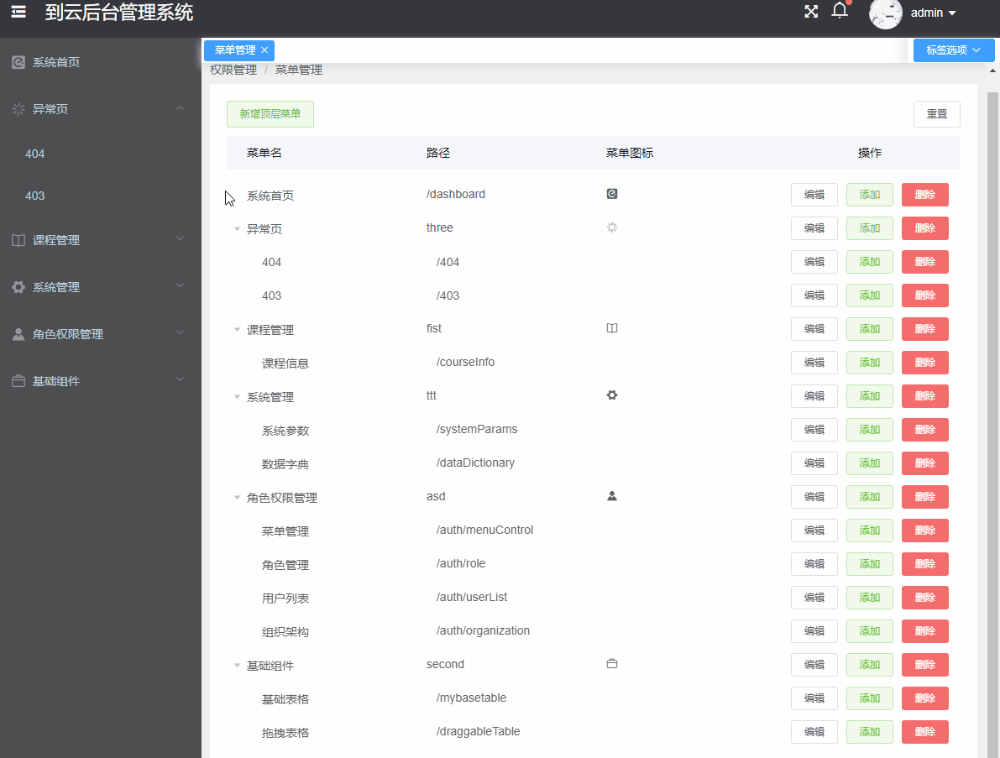
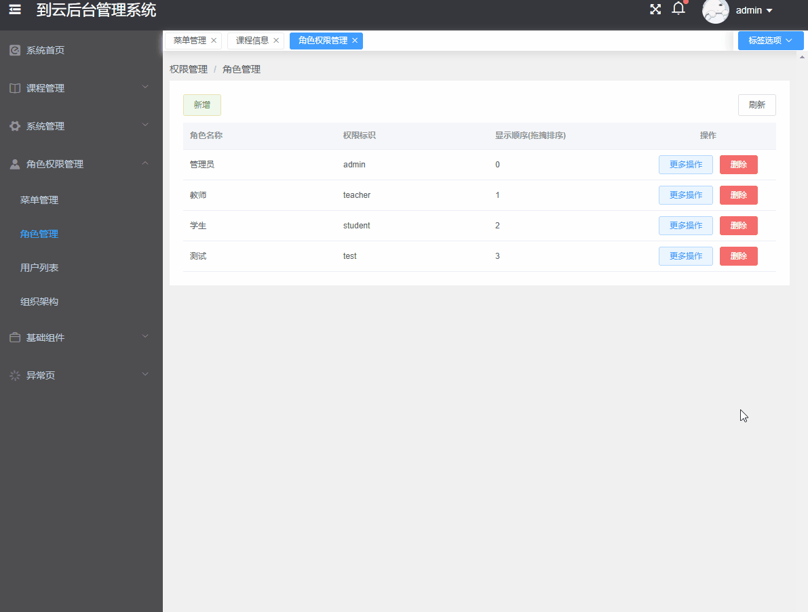
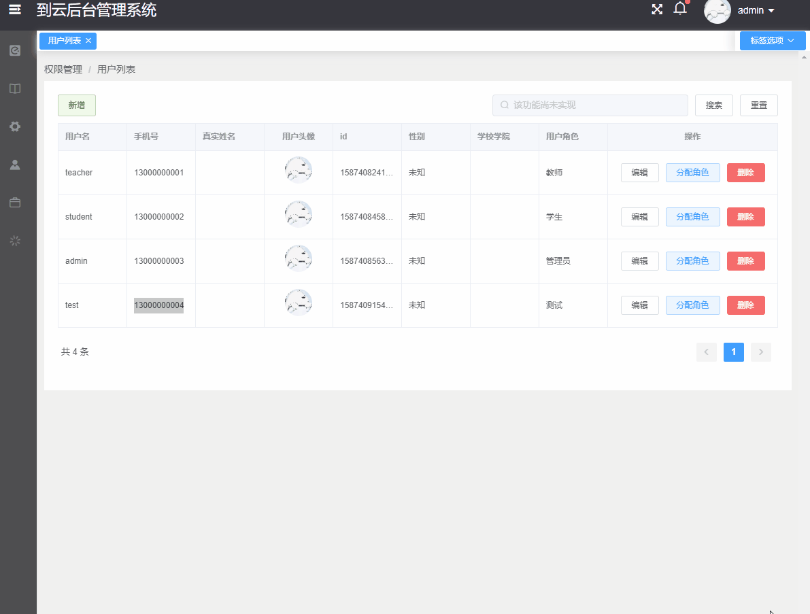
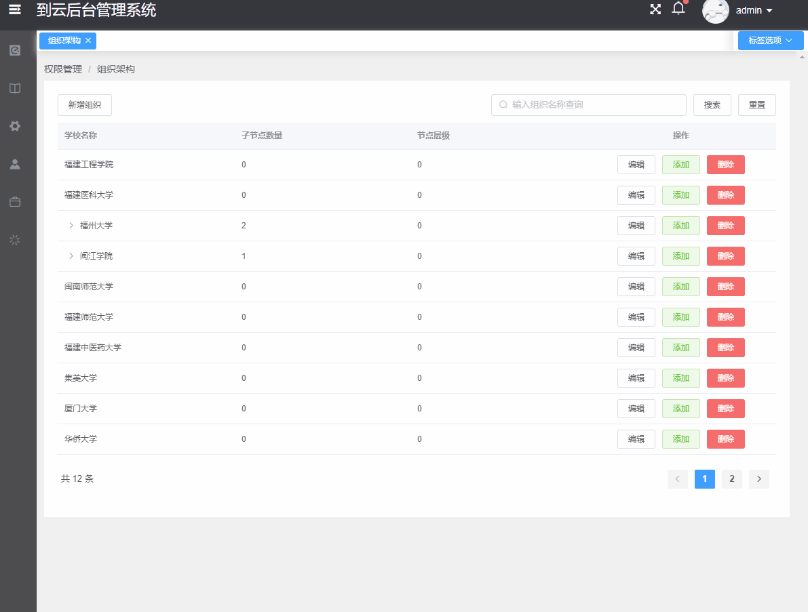
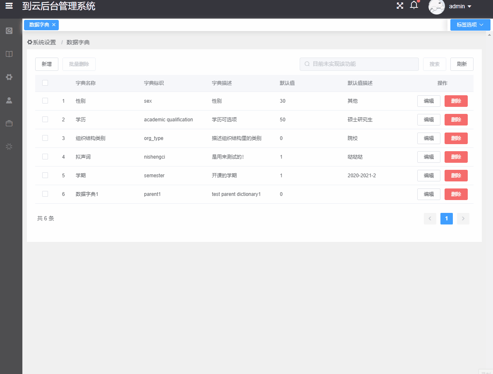
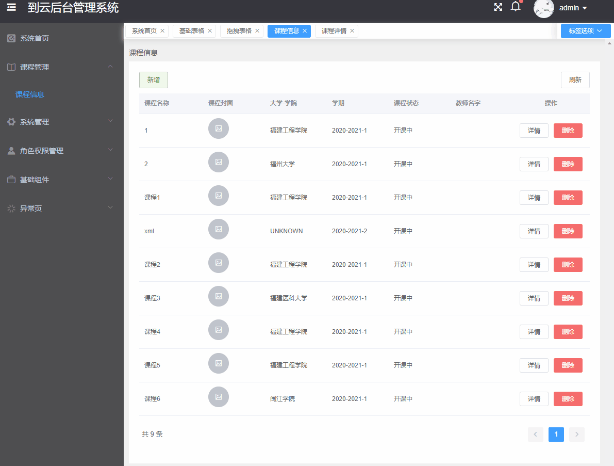

# Attandence
## 项目包含页面
+ course 课程管理
+ dictionary 数据字典
+ system-params 系统参数
+ menuCtrl 菜单管理
+ myInfo 个人信息
+ organization 组织管理
+ passport 登录与注册
+ role 角色管理
+ userList 用户列表
+ 403 
+ 404

## 登录
由于目前后端没有连接短信服务，目前无法注册.

前端demo网页： http://120.78.228.248

目前有三个账号可供登录： 需要注意的是，不同类型账户的侧边栏菜单选项不同
+ 账户：admin   密码：123456
+ 账户：teacher   密码：123456
+ 账户：student   密码：123456

## 注册

## 菜单管理
管理侧边栏菜单，对应可到达的页面

通过拖拽可以对页面进行排序，目前仅支持同级排序,且侧边栏需要刷新后才会生效

## 角色管理
通过角色管理，可以给用户添加不同角色.并给角色配置目录权限.  配置之后不同角色的账户侧边栏会发生改变.

## 用户列表
在用户列表可以CRUD用户信息，同时可以对用户的角色进行重新分配.

## 组织管理
在该页面，可以添加修改组织。通过树形结构添加组织, 该页面支持搜索. 

该数据类似字典管理，在课程添加，个人信息页面中会进行加载获取。

## 数据字典
通过该页面,可以修改可选项的值. 并修改显示顺序.

> 需要注意的是在web端的页面中，仅用到Setx Role两个数据字典数据, 因此只有这两个数据在选择时会随之改变

## 课程管理
课程的crud，需要注意的是该页面中会用到之前数据字典和组织管理中的一些数据，这些数据会随修改而改变.

> 后端目前未配置文件上传相关内容，因此无法上传图片. 也因此，页面不会自动刷新，需要手动刷新查看新添加的课程

## 后端仓库
[AttendanceBackEnd](https://github.com/chenjr15/Attendance)
## 本项目是在lin-xin的后台解决方案的基础上进行开发的
以下是lin-xin的仓库地址
>https://github.com/lin-xin/vue-manage-system
